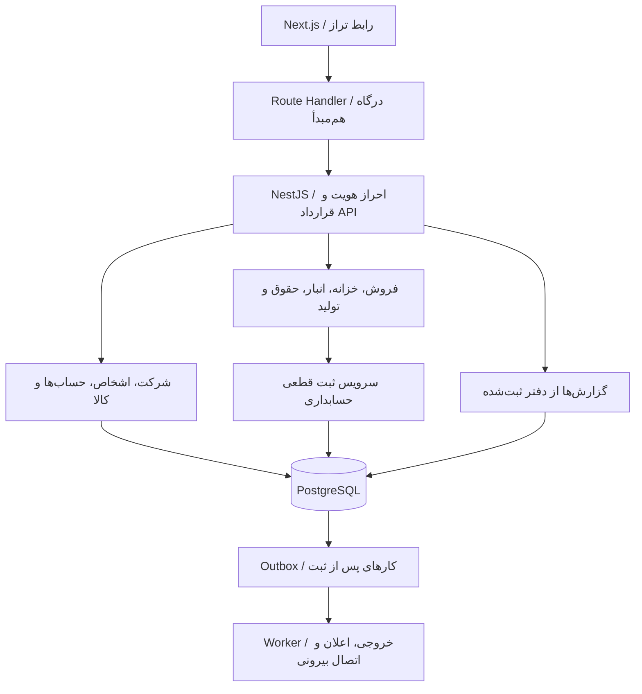
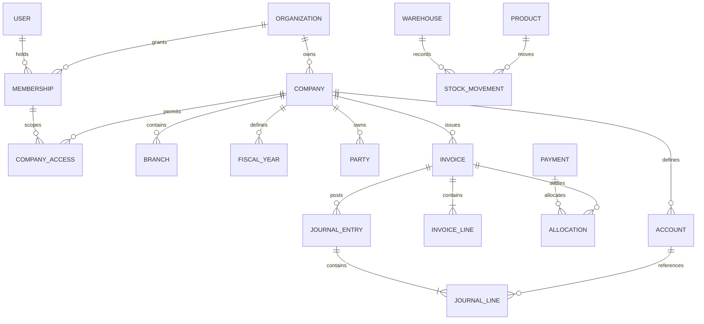

# نقشهٔ پیاده‌سازی بک‌اند تراز

این سند برای تبدیل رابط فعلی به یک سامانهٔ حسابداری عملیاتی تهیه شده است. مرجع آن سورس همین مخزن و بررسی مورخ ۷ سپتامبر ۲۰۲۶ است. پیشنهاد معماری زیر متناسب با پروژهٔ فعلی است؛ API آزمایشی موجود، بک‌اند مالی آمادهٔ بهره‌برداری محسوب نمی‌شود.

## پیشنهاد اصلی

برای این پروژه **NestJS + TypeScript + PostgreSQL** را به صورت یک برنامهٔ واحد با ماژول‌های مستقل پیشنهاد می‌کنم. فرانت‌اند Next.js باقی بماند و به سرویس جداگانه متصل شود. برای مدل داده و migration می‌توان از Prisma استفاده کرد؛ محدودیت‌های حسابداری و تراکنش‌های حساس باید صریحاً در سرویس دامنه و دیتابیس پیاده شوند، نه صرفاً در ORM.

دلیل این انتخاب، اشتراک زبان با فرانت‌اند، جدا شدن مسئولیت منطق مالی از نمایش، و امکان نگهداری تراکنش فروش، موجودی و سند حسابداری در یک دیتابیس است. در شروع به microservice نیاز ندارید. اگر تیم بک‌اند از قبل در ASP.NET Core یا Go مهارت دارد، همان فناوری همراه PostgreSQL هم انتخاب مناسبی است؛ صحت دفتر و تست‌پذیری از یکسان بودن زبان مهم‌تر است.

| بخش           | انتخاب پیشنهادی                                           | زمان اضافه شدن                                 |
| ------------- | --------------------------------------------------------- | ---------------------------------------------- |
| رابط          | Next.js فعلی                                              | موجود                                          |
| API و دامنه   | NestJS، REST و قرارداد OpenAPI                            | از ابتدا                                       |
| داده          | PostgreSQL، migration نسخه‌دار، Prisma و SQL در نقاط لازم | از ابتدا                                       |
| محاسبات       | نوع Decimal و سیاست گرد کردن مشخص                         | از ابتدا                                       |
| نشست و دسترسی | نشست قابل ابطال، عضویت شرکت و مجوزهای عملیاتی             | از ابتدا                                       |
| فایل          | فضای خصوصی سازگار با S3 برای پیوست‌ها                     | هنگام ساخت پیوست                               |
| کارهای طولانی | worker و BullMQ/Redis                                     | هنگام نیاز به خروجی بزرگ، اعلان و یکپارچه‌سازی |
| مشاهده‌پذیری  | log ساختاریافته، شناسهٔ درخواست، متریک و هشدار            | پیش از استقرار واقعی                           |

Nest مستندات رسمی برای تولید قرارداد OpenAPI و اتصال صف‌های BullMQ دارد. صف را برای کارهای جانبی به کار ببرید؛ ثبت اصلی دفتر باید پیش از پاسخ موفق در تراکنش دیتابیس نهایی شود. [OpenAPI در Nest](https://docs.nestjs.com/openapi/introduction)، [صف‌ها در Nest](https://docs.nestjs.com/techniques/queues).



درگاه Next می‌تواند کوکی مرورگر را مدیریت کند و درخواست را به بک‌اند برساند. اعتبارسنجی نقش، شرکت، سال مالی و قواعد مالی همچنان باید در بک‌اند انجام شود. آدرس داخلی و کلیدهای سرویس را در متغیرهای محیطی سمت سرور نگه دارید.

## وضعیت فعلی و نقطه‌های اتصال

| فایل                               | نقش فعلی                                       | اقدام در مهاجرت                                       |
| ---------------------------------- | ---------------------------------------------- | ----------------------------------------------------- |
| `src/components/provider.tsx`      | bootstrap، scope، تنظیمات، fetch و پیام خطا    | اتصال به قرارداد جدید و نگاشت خطاهای فیلدی            |
| `src/app/api/[...path]/route.ts`   | تمام endpointهای mock                          | تبدیل به proxy یا جایگزینی مسیرها با API واقعی        |
| `src/lib/server.ts`                | اعتبارسنجی و مجوزهای نمونه                     | تبدیل به DTO، policy و سرویس دامنهٔ مستقل             |
| `src/lib/store.ts`                 | فایل JSON با صف نوشتن در یک پردازش             | حذف از اجرای عملیاتی و جایگزینی با repository دیتابیس |
| `src/lib/domain.ts`                | محاسبات نمونه و تولید دفتر از وضعیت فعلی اسناد | منبع سناریوی تست؛ بازطراحی ثبت قطعی و Decimal         |
| `src/lib/reports.ts`               | گزارش روی مجموعه‌های درون حافظه                | query از دفتر واقعی با فیلتر و snapshot معتبر         |
| `src/lib/modules.ts`               | metadata ماژول و فیلدهای نمایش                 | حفظ برای UI؛ جایگزین schema و مجوز بک‌اند نیست        |
| `src/components/search-select.tsx` | انتخاب جست‌وجودار با گزینه‌های bootstrap       | افزودن جست‌وجوی سمت سرور برای مجموعه‌های بزرگ         |
| `tests/e2e.mjs`                    | تست با دیتای مستقل                             | استفاده از سناریوها برای تست قرارداد جدید             |

مسیرهای جاری در README آمده‌اند. در حال حاضر فهرست کامل رکوردها و lookupها دریافت و جست‌وجو در مرورگر انجام می‌شود. این روش برای dummy مناسب است؛ برای صدها هزار سند باید جست‌وجو، فیلتر هر ستون، مرتب‌سازی، صفحه‌بندی و خروجی به سرور منتقل شوند.

## مدل داده و مرز شرکت‌ها

یک شرکت شخصیت مالی مستقل است و شعبه واحد عملیاتی همان شرکت. اگر یک مشتری چند شرکت دارد، موجودیت `Organization` را به عنوان فضای عضویت/اشتراک تعریف کنید و دفتر هر `Company` را جدا نگه دارید. گزارش تلفیقی شرکت‌ها نیازمند ارز ارائه، نگاشت حساب و حذف معاملات بین شرکت‌هاست؛ جمع سادهٔ داشبوردها گزارش تلفیقی نیست.



این نمودار هسته را نشان می‌دهد؛ مدل‌های حقوق، دارایی، تولید و پروژه نیز در جدول بعد آمده‌اند. در طراحی نهایی، روابط `company_id`، شعبه و سال مالی باید برای تمام این مدل‌ها صریح باشند.

- جدول مالی: `id`, `company_id`, `branch_id`, `fiscal_year_id`, `document_date`, `created_at`, `created_by`, `version` و وضعیت.
- اطلاعات پایه مثل شخص و کالا: متعلق به شرکت، قابل استفاده در دوره‌های مختلف؛ با بستن سال حذف یا تکثیر نشوند.
- حساب: کد یکتا در شرکت، والد، نوع/ماهیت، اجازهٔ ثبت، وضعیت و نگاشت کاربردهایی مانند فروش و دریافتنی.
- سند دفتر: منبع سند، شمارهٔ قطعی، تاریخ، ارز مبنا، تأییدکننده، زمان ثبت، مرجع سند برگشتی و آرتیکل‌ها.
- آرتیکل: حساب، بدهکار/بستانکار در ارز مبنا، مبلغ و ارز معامله، نرخ، شخص، پروژه، مرکز هزینه و شعبه در صورت کاربرد.
- نرخ، نام طرف حساب روی فاکتور، شرح کالا، مالیات، قیمت و هزینهٔ تخصیص‌یافته باید snapshot سند باشند؛ تغییر اطلاعات پایه نباید گزارش گذشته را عوض کند.

برای جلوگیری از ارجاع بین شرکت‌ها، فقط بررسی UI کافی نیست. روی موجودیت‌های مرجع کلید یکتای مرکب `(company_id, id)` و روی وابستگی‌ها foreign key مرکب قرار دهید. در هر درخواست، scope ارسالی را با عضویت کاربر اعتبارسنجی کنید؛ داشتن شناسهٔ شرکت مجوز دسترسی نیست.

RLS می‌تواند لایهٔ دفاعی دیگری باشد، اما owner جدول و نقش‌های دارای `BYPASSRLS` رفتار ویژه دارند. اگر از آن استفاده می‌کنید، نقش اتصال برنامه و context تراکنش/connection pool را طراحی و تست کنید؛ RLS جای policy برنامه را نمی‌گیرد. [سیاست‌های سطری PostgreSQL](https://www.postgresql.org/docs/current/ddl-rowsecurity.html).

## پول، ارز و تاریخ

مبلغ API را به شکل رشتهٔ اعشاری بفرستید؛ `number` جاوااسکریپت و `float` مبنای مناسب دفتر قطعی نیستند. PostgreSQL نوع دقیق `numeric` را برای مقادیر نیازمند دقت، از جمله پول، ارائه می‌کند. مقیاس نمونهٔ طراحی می‌تواند `numeric(24,6)` برای مبلغ محاسباتی و `numeric(24,10)` برای نرخ باشد؛ سقف مبلغ و مقیاس را با نیاز واقعی تعیین کنید. [انواع عددی PostgreSQL](https://www.postgresql.org/docs/current/datatype-numeric.html).

برای هر شرکت یک ارز مبنای دفتر انتخاب کنید و بعد از ثبت قطعی تغییر آن را به عملیات مهاجرت کنترل‌شده محدود کنید. در نسخهٔ فعلی مبنا تومان است؛ قرارداد عملیاتی باید رابطهٔ ریال/تومان را صریح تعریف کند. نام نمایشی «تومان» را به جای شناسهٔ پایدار ارز ذخیره نکنید. کد داخلی واحد نمایش و ضریب تبدیل، جدا از ارز معامله باشند.

سیاست گرد کردن را برای قیمت، تخفیف ردیف، تخفیف کل، مالیات، تسویه و تبدیل ارز مشخص و نسخه‌دار کنید. اختلاف گرد کردن باید به حساب مربوط ثبت شود. نرخ هر سند ثابت بماند؛ تسویه با نرخ متفاوت نیازمند ثبت سود/زیان تسعیر است. مقادیر نمایش‌داده‌شده در UI صرفاً پیش‌نمایش‌اند؛ سرور مبلغ معتبر را محاسبه و برمی‌گرداند.

تاریخ سند مالی را `date`، زمان فعالیت را `timestamptz` و منطقهٔ زمانی شرکت را تنظیم مستقل نگه دارید. API تاریخ سند را `YYYY-MM-DD` و زمان رویداد را ISO با offset بگیرد. تبدیل شمسی/میلادی در UI انجام شود؛ تاریخ سند را با تبدیل خودکار نیمه‌شب به UTC جابه‌جا نکنید.

## ثبت قطعی: مهم‌ترین بخش بک‌اند

برای اسناد مالی، تغییر وضعیت را از `PATCH` عمومی جدا کنید. پیش‌نویس قابل ویرایش است؛ ثبت قطعی یک فرمان مستقل است. سند قطعی را حذف یا با تغییر status از دفتر ناپدید نکنید؛ اصلاح با سند برگشتی مرتبط و در صورت نیاز سند جایگزین انجام شود.

```text
POST /v1/companies/{companyId}/sales/{id}/post
Idempotency-Key: <uuid>
If-Match: "<version>"

BEGIN TRANSACTION
  بررسی عضویت، مجوز و سال مالی باز
  خواندن/قفل سند و کنترل version و وضعیت
  ثبت/بررسی کلید تکرار درخواست و hash بدنه
  کنترل وابستگی‌ها، موجودی قابل مصرف و ماندهٔ قابل تسویه
  محاسبهٔ مبالغ و snapshotهای قیمت/نرخ/هزینه
  اختصاص شمارهٔ قطعی در محدودهٔ تعریف‌شده
  ساخت journal_entry و journal_lines متوازن
  ساخت stock_movements یا payment_allocations مرتبط
  ثبت وضعیت قطعی، audit_event و outbox_event
COMMIT
  پاسخ با همان نتیجهٔ ثبت‌شده برای تکرار درخواست
```

برای عملیات حساس، یک راه شروع تراکنش Serializable با retry محدود کل تراکنش است؛ راه دیگر قفل‌گذاری دقیق رکوردهای مانده با ترتیب ثابت است. انتخاب را با آزمون هم‌زمانی تثبیت کنید. PostgreSQL در سطوح قوی‌تر هم ممکن است خطای serialization بدهد و برنامه باید تراکنش را دوباره اجرا کند. [ایزولیشن تراکنش](https://www.postgresql.org/docs/current/transaction-iso.html).

کلید idempotency باید در محدودهٔ شرکت/عملیات یکتا و به محتوای درخواست وابسته باشد؛ استفادهٔ دوباره با بدنهٔ متفاوت خطای conflict بدهد. side effect خارجی را داخل retry اجرا نکنید. outbox در همان تراکنش ذخیره شود و worker با شناسهٔ رویداد، پردازش تکراری را خنثی کند.

کنترل‌های الزامی دفتر پیشنهادی:

1. مجموع بدهکار و بستانکارِ ارز مبنا دقیقاً برابر باشد؛ آستانهٔ خطای شناور جای این قاعده نیست.
2. هر آرتیکل فقط یک سمت مثبت داشته باشد و حساب قابل ثبت متعلق به همان شرکت باشد.
3. ثبت قطعی در دورهٔ بسته، ارجاع به شعبهٔ نامجاز و تغییر منبع ثبت‌شده رد شود.
4. هر اثر مالی منبع یکتای مشخص داشته باشد؛ retry نباید سند دوم بسازد.
5. مانده از دفتر قابل بازسازی باشد. جدول balance می‌تواند شتاب‌دهنده باشد، اما مرجع مستقل و قابل ویرایش نباشد.
6. برابری مجموع آرتیکل‌ها را در سرویس و کنترل دیتابیسی مناسب مثل trigger تعویقی بررسی کنید؛ `CHECK` سادهٔ یک ردیف برای مجموع چند آرتیکل کافی نیست.

شمارهٔ پیش‌نویس می‌تواند UUID باشد. شمارهٔ قطعی را سرور و در محدودهٔ شرکت/سال/نوع سند صادر کند. اگر شماره‌گذاری بدون شکاف نیاز تجاری شماست، جدول شمارندهٔ قفل‌شونده و سیاست ابطال شماره طراحی کنید؛ sequence معمولی تضمین بدون شکاف نمی‌دهد.

## مسئولیت بک‌اند هر بخش

| رابط موجود                       | موجودیت/سرویس پیشنهادی                                        | کار لازم برای استفادهٔ واقعی                                         |
| -------------------------------- | ------------------------------------------------------------- | -------------------------------------------------------------------- |
| شرکت، شعبه، سال مالی، ارز، کاربر | Company, Branch, Period, Currency, Membership, Permission     | عضویت محدود، دوره‌های غیرهم‌پوشان، مجوز شعبه، سیاست نرخ              |
| اشخاص                            | Party, PartyContact, CreditPolicy                             | نقش مشتری/تأمین‌کننده، سقف اعتبار، مانده از دفتر                     |
| کدینگ و اسناد                    | Account, JournalEntry, JournalLine, PostingRule               | درخت حساب، حساب تفصیلی/ابعاد، ثبت قطعی و برگشتی                      |
| کالا و انبار و گردش              | Product, Unit, Warehouse, StockMovement, CostLayer            | واحدها، رزرو، انتقال دوطرفه، کاردکس و بهای تاریخی                    |
| پیش‌فاکتور                       | Quote, QuoteLine                                              | نسخه، اعتبار، تبدیل قابل ردیابی و جلوگیری از تبدیل ناخواستهٔ چندباره |
| فروش و خرید                      | Invoice, InvoiceLine                                          | قیمت و مالیات snapshot، شمارهٔ قطعی، اثر دفتر و موجودی               |
| برگشت فروش/خرید                  | CreditNote, ReturnLine                                        | ارجاع به ردیف اصل، سقف برگشت و هزینهٔ همان خروج اولیه                |
| بانک، صندوق و تنخواه             | CashAccount, BankAccount, Reconciliation                      | مانده از دفتر، مغایرت بانکی و افتتاحیهٔ کنترل‌شده                    |
| دریافت و پرداخت                  | Payment, PaymentAllocation                                    | تسویهٔ چند فاکتور، جزئی/کامل، جلوگیری از پرداخت بیش از مانده         |
| انتقال وجه                       | Transfer                                                      | دو سمت در یک تراکنش، کارمزد و در صورت نیاز تبدیل ارز                 |
| چک                               | Check, CheckEvent                                             | تاریخچهٔ دریافت، واگذاری، وصول و برگشت با ثبت متناسب                 |
| هزینه و سایر درآمد               | Expense, OtherIncome                                          | سرفصل حساب، روش تسویه، ابعاد پروژه و پیوست                           |
| کارکنان و حقوق                   | Employee, PayrollRun, Payslip, PayrollComponent               | محاسبات نسخه‌دار، دوره، تأیید، پرداخت و قواعد حوزهٔ فعالیت           |
| دارایی و استهلاک                 | Asset, DepreciationSchedule, DepreciationPosting              | برنامهٔ دوره‌ای، تغییر برآورد، فروش/اسقاط و جلوگیری از ثبت تکراری    |
| فرمول ساخت و تولید               | BomVersion, ProductionOrder, MaterialIssue, ProductionReceipt | نسخهٔ فرمول، مصرف واقعی، ضایعات، سربار و کالای در جریان ساخت         |
| پروژه و هزینه/درآمد              | Project, Budget, CostCenter, ProjectTransaction               | بودجه و واقعی، تخصیص هزینه، درآمد و ابعاد مشترک دفتر                 |
| گزارش و داشبورد                  | LedgerQuery, ReportRun                                        | گزارش از دفتر قطعی، snapshot یکسان، خروجی حجیم و تطبیق جمع‌ها        |
| تنظیمات و فعالیت‌ها              | CompanySettings, AuditEvent                                   | تاریخ مؤثر تنظیمات و لاگ ماندگار با قبل/بعد و عامل تغییر             |

برای موجودی ابتدا یک روش ارزش‌گذاری مشخص، مانند میانگین موزون متحرک، انتخاب کنید و سپس FIFO را در صورت نیاز اضافه کنید. ثبت با تاریخ گذشته، برگشت و اصلاح خرید روی هزینه اثر دارند؛ این رفتار باید قبل از پیاده‌سازی تعیین شود. قیمت خرید فعلی کالا نباید بهای تمام‌شدهٔ فروشِ ماه قبل را تغییر دهد.

در حقوق، مالیات و اتصال‌های رسمی، قواعد را به صورت ماژول وابسته به حوزهٔ فعالیت و تاریخ اجرا طراحی کنید. نرخ‌های dummy و فرمول سادهٔ فعلی را به عنوان قواعد قانونی منتقل نکنید. جزئیات مقررات و فایل‌های خروجی باید در زمان اجرای آن ماژول، با مرجع رسمی و مسئول مالی همان کسب‌وکار مشخص شوند.

## قرارداد API پیشنهادی

API جدید را نسخه‌دار کنید. این نمونه **پیشنهاد قرارداد آینده** است و در mock فعلی پیاده نشده است:

```http
GET /v1/companies/{companyId}/sales?branchId=all&fiscalYearId={id}&q=آریا&filter[status]=posted&filter[personId]={id}&from=2026-03-21&to=2027-03-20&sort=-date&limit=25&cursor={cursor}
```

```json
{
  "items": [
    {
      "id": "invoice-uuid",
      "number": "SALE-1405-000042",
      "status": "posted",
      "date": "2026-09-07",
      "currencyCode": "IRR",
      "total": "12500000.00",
      "remaining": "2500000.00",
      "version": 3
    }
  ],
  "page": { "nextCursor": null, "hasMore": false },
  "summary": { "total": "12500000.00", "count": 1 }
}
```

برای حفظ شمارهٔ صفحات فعلی می‌توانید offset pagination به همراه سقف اندازه و ترتیب پایدار انتخاب کنید؛ برای دفتر بزرگ cursor مناسب‌تر است و UI صفحه‌بندی هم باید متناسب با آن تغییر کند. مجموع و تعداد کل را جدا از صفحهٔ جاری حساب کنید. فیلترها و ستون‌های مرتب‌سازی whitelist باشند.

| عملیات                 | endpoint پیشنهادی                                              |
| ---------------------- | -------------------------------------------------------------- |
| دادهٔ اولیهٔ سبک       | `GET /v1/session/bootstrap`                                    |
| گزینه‌های قابل جست‌وجو | `GET /v1/companies/{id}/lookups/products?q=...&cursor=...`     |
| ذخیرهٔ پیش‌نویس        | `POST /v1/companies/{id}/sales`                                |
| ویرایش با کنترل نسخه   | `PATCH /v1/companies/{id}/sales/{invoiceId}` + `If-Match`      |
| ثبت قطعی               | `POST /v1/companies/{id}/sales/{invoiceId}/post`               |
| برگشت اثر مالی         | `POST /v1/companies/{id}/sales/{invoiceId}/reverse`            |
| تبدیل پیش‌فاکتور       | `POST /v1/companies/{id}/quotes/{quoteId}/convert`             |
| تسویه                  | `POST /v1/companies/{id}/payments` همراه allocationها          |
| بستن سال               | `POST /v1/companies/{id}/fiscal-years/{yearId}/close`          |
| گزارش                  | `GET /v1/companies/{id}/reports/trial-balance?from=...&to=...` |
| خروجی بزرگ             | `POST /v1/companies/{id}/exports` سپس دریافت وضعیت job         |

```json
{
  "error": {
    "code": "INSUFFICIENT_STOCK",
    "message": "موجودی کالا برای ثبت این فاکتور کافی نیست.",
    "fieldErrors": { "lines.0.quantity": "حداکثر مقدار قابل مصرف ۳ است." },
    "requestId": "request-uuid"
  }
}
```

کدهای پایدار خطا و وضعیت را انگلیسی نگه دارید و ترجمه را در UI انجام دهید. از 401 برای ورود نامعتبر، 403 برای مجوز، 404 برای رکورد ناموجود/غیرقابل مشاهده طبق policy، 409 برای تعارض نسخه/وضعیت، 422 برای اعتبارسنجی و 429 برای محدودیت درخواست استفاده کنید. UI باید خطای فیلد را کنار همان فیلد نمایش دهد و دادهٔ واردشده را حفظ کند.

## دسترسی، نگهداری و استقرار

مجوزها را عملیاتی تعریف کنید: `sales.read`, `sales.create`, `sales.post`, `sales.reverse`, `ledger.read`, `period.close`, `users.manage`. نقش‌ها مجموعهٔ این مجوزها هستند و می‌توانند برای هر شرکت متفاوت باشند. مدیر یک شرکت نباید خودبه‌خود مدیر تمام شرکت‌ها شود.

برای نشست، عمر محدود، ابطال هنگام خروج/تغییر رمز، محافظت درخواست تغییردهنده، محدودیت تلاش ورود و فرایند بازیابی رمز لازم است. حساب‌ها و رمزهای demo باید در محیط واقعی غیرفعال باشند. audit مالی را append-only طراحی کنید و رویداد را با actor، شرکت، منبع، تغییر قبل/بعد، زمان و request ID نگه دارید؛ دادهٔ حساس مثل رمز و توکن را وارد log نکنید.

ایندکس‌های شروع: `(company_id, fiscal_year_id, document_date, id)` برای دفتر، `(company_id, account_id, document_date)` برای کل، `(company_id, party_id, status, due_date)` برای مطالبات، و `(company_id, warehouse_id, product_id, document_date)` برای گردش کالا. پس از داشتن دادهٔ واقعی، query plan و زمان پاسخ را اندازه بگیرید و سپس ایندکس‌ها را اصلاح کنید.

استقرار اولیه شامل web، API، PostgreSQL و در صورت نیاز worker باشد. migration در مرحلهٔ کنترل‌شدهٔ انتشار اجرا شود. backup زمان‌بندی‌شده، بازیابی نقطه‌ای متناسب با نیاز، نگهداری امن فایل‌ها و تمرین restore بخشی از تحویل‌اند. وجود فایل backup بدون تست بازیابی معیار آمادگی نیست. برای گزارش چند query، snapshot سازگار در نظر بگیرید تا ثبت هم‌زمان جمع‌ها را نامتوازن نشان ندهد.

## ترتیب اجرا و معیار خروج هر مرحله

| مرحله                       | خروجی قابل تحویل                                        | معیار پذیرش                                             |
| --------------------------- | ------------------------------------------------------- | ------------------------------------------------------- |
| ۱. قرارداد و تصمیم‌های مالی | OpenAPI، ERD، ارز مبنا، گرد کردن، ارزش‌گذاری و وضعیت‌ها | سناریوی نمونه با مسئول مالی تأیید و ابهام‌ها ثبت شده    |
| ۲. زیرساخت و اطلاعات پایه   | دیتابیس، migration، نشست، شرکت، عضویت، حساب، شخص و کالا | هیچ خواندن/نوشتن بین شرکت‌های غیرمجاز ممکن نباشد        |
| ۳. هستهٔ دفتر               | پیش‌نویس، ثبت قطعی، برگشتی، افتتاحیه و تراز             | آزمون عدم‌توازن، retry و immutable بودن گذشته پاس شود   |
| ۴. یک جریان عمودی           | خرید/ورود موجودی → فروش → دریافت → دفتر/گزارش           | جمع مبلغ، موجودی، ماندهٔ مشتری و دفتر تطبیق داشته باشند |
| ۵. تکمیل خزانه و انبار      | برگشت، پرداخت، انتقال، چک و مغایرت                      | پرداخت هم‌زمان و فروش هم‌زمان باعث اضافه‌مصرف نشود      |
| ۶. ماژول‌های تکمیلی         | حقوق، دارایی، تولید و پروژه                             | هر عملیات سند مرتبط و امکان ردیابی/برگشت داشته باشد     |
| ۷. پایان دوره و گزارش       | بستن، افتتاح دورهٔ بعد، گزارش‌ها و خروجی                | ماندهٔ اختتامیه/افتتاحیه و تمام گزارش‌ها تطبیق کنند     |
| ۸. آماده‌سازی بهره‌برداری   | migration واقعی، بار، امنیت، backup و پایلوت            | پذیرش سناریوهای واقعی و آزمون بازیابی موفق              |

بستن سال را یک تغییر status ساده در نظر نگیرید: اسناد معلق و مغایرت‌ها را مشخص کنید، حساب‌های موقت را طبق سیاست ببندید، اختتامیه و افتتاحیهٔ سال بعد را قابل ردیابی بسازید و بازگشایی را مجوزدار و ثبت‌شده انجام دهید.

## آزمون‌هایی که پیش از دادهٔ واقعی لازم‌اند

- دو فروش هم‌زمان برای آخرین موجودی؛ فقط مقدار مجاز ثبت شود.
- دو دریافت هم‌زمان برای یک مانده؛ جمع تخصیص از مانده بیشتر نشود.
- ارسال دوبارهٔ ثبت قطعی با یک کلید؛ دقیقاً یک اثر مالی و انباری.
- قطع پردازش بین ثبت فاکتور و آرتیکل؛ هیچ اثر نیمه‌کاره باقی نماند.
- اصلاح قیمت کالا، نام مشتری، نرخ و تنظیمات؛ سند و گزارش قطعی گذشته ثابت بمانند.
- تاریخ مرزی دوره و سال کبیسه، مقادیر بسیار بزرگ، اعشار و چند نرخ مالیات.
- برگشت جزئی و چندباره؛ مقدار برگشت از سند اصل بیشتر نشود.
- تغییر هم‌زمان یک پیش‌نویس؛ نسخهٔ قدیمی با conflict برگردد، دادهٔ جدید بی‌صدا بازنویسی نشود.
- شعبه و شرکت غیرمجاز، حساب غیرفعال، دورهٔ بسته و دسترسی به خروجی/پیوست دیگران.
- تراز دفتر، موجودی و بانک پس از ثبت، برگشت، بستن سال و restore یکسان باشد.

## مهاجرت تدریجی از همین پروژه

1. fixtureهای dummy را برای توسعه و تست نگه دارید؛ آن‌ها را دادهٔ اولیهٔ مشتری واقعی نکنید.
2. قرارداد OpenAPI و client تایپ‌شده بسازید؛ مسیرهای UI و کامپوننت‌ها فعلاً حفظ شوند.
3. ابتدا bootstrap سبک، احراز هویت و اطلاعات پایه را وصل کنید و سپس جریان عمودی فروش را کامل کنید.
4. مدل `Row` عمومی را در لایهٔ API با DTOهای دقیق هر ماژول جایگزین کنید. `status` فارسی و مقادیر `number` فعلی نیازمند adapter و سپس اصلاح فرم‌ها هستند.
5. برای هر ماژول یک منبع حقیقت داشته باشید؛ یک سند را هم‌زمان در فایل mock و دیتابیس واقعی ننویسید.
6. محاسبات UI را فقط برای پیش‌نمایش نگه دارید. پس از ذخیره، مبلغ/نسخه/وضعیت برگشتی سرور نمایش داده شود.
7. lookupهای بزرگ را با debounce، لغو درخواست قبلی و صفحه‌بندی به SearchSelect متصل کنید؛ تست کیبورد و انتخاب فعلی حفظ شود.
8. قبل از انتقال مشتری، خروجی سیستم قبلی را staging کنید، mapping حساب‌ها/ارزها را بررسی و جمع افتتاحیه را تطبیق دهید. نتیجه و امکان rollback مستند شود.

## مواردی که در mock فعلی عمداً عملیاتی نیستند

دفتر در هر گزارش از وضعیت فعلی اسناد محاسبه می‌شود؛ immutable ledger، cost layer تاریخی، انتقال خودکار سال، عضویت محدود به شرکت، موتور مجوز ریزدانه، workflow تأیید چندمرحله‌ای، پیوست، اعلان واقعی، API بانکی، اتصال مالیاتی، import انبوه، رزرو/سریال/بچ کالا، قواعد قانونی حقوق و گزارش تلفیقی در نسخهٔ فعلی ساخته نشده‌اند. بازگشت وضعیت سند به پیش‌نویس صرفاً رفتار آزمایشی است. این‌ها باید بر اساس نیاز کسب‌وکار در بک‌اند و در صورت نیاز در صفحات جدید توسعه یابند.

برای شروع عملی، مرحلهٔ ۱ تا ۴ را هدف تحویل اول قرار دهید: **یک فروشِ ثبت‌شده با موجودی، دریافت و دفتر متوازن**. وقتی این مسیر با هم‌زمانی و بازیابی خطا قابل اتکا شد، بقیهٔ ماژول‌ها را روی همان هسته بسازید.
